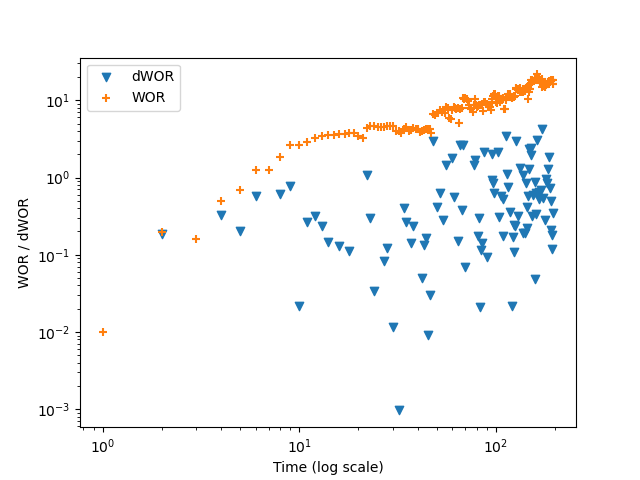
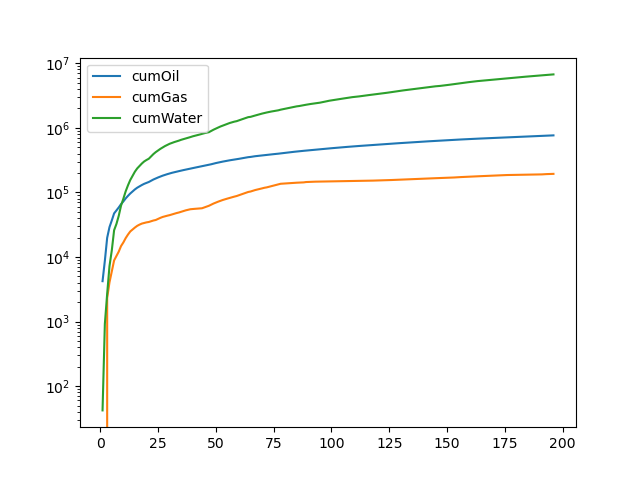

# Well-Performance-Analysis-and-Water-Breakthrough-Diagnostics
This project analyzes well performance using production and spatial data to evaluate reservoir behaviour and diagnose potential water breakthrough.  The analysis integrates well filtering, Water-Oil Ratio (WOR) trends, and cumulative production to assess well performance over time.
## Objectives
- Filter and classify wells based on characteristics  
- Analyze Water-Oil Ratio (WOR) trends  
- Detect early signs of water breakthrough using dWOR  
- Evaluate cumulative production performance  

## Tools & Technologies
- Python  
- Pandas  
- Matplotlib  

## Sample Visualizations

### WOR and dWOR Diagnostic Plot


### Cumulative Production Trends


## Key Insights
- Increasing WOR suggests water breakthrough  
- dWOR helps detect early changes in production behaviour  
- Cumulative production trends highlight long-term performance  
- Data filtering enables targeted engineering analysis  

## Data
The dataset used in this project is not publicly available.  
A sample dataset is provided for demonstration purposes.

## How to Run
```bash
pip install -r requirements.txt
jupyter notebook
